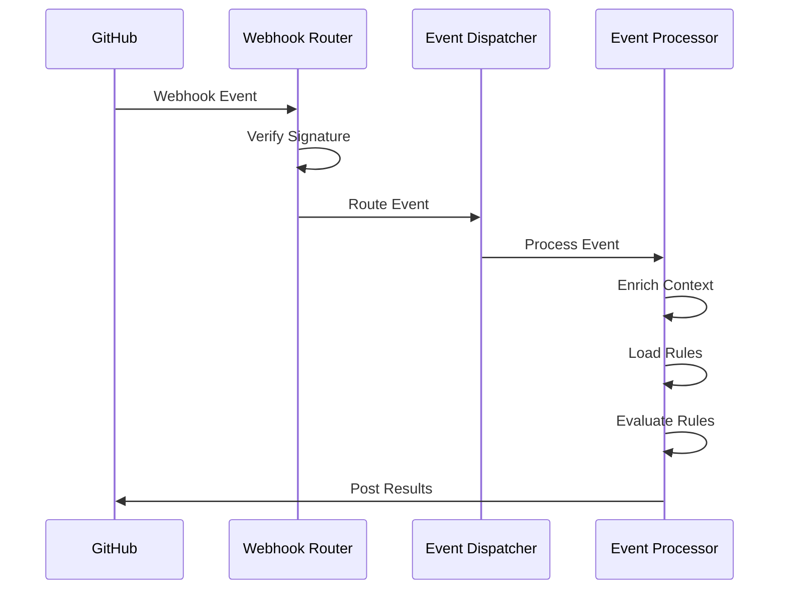
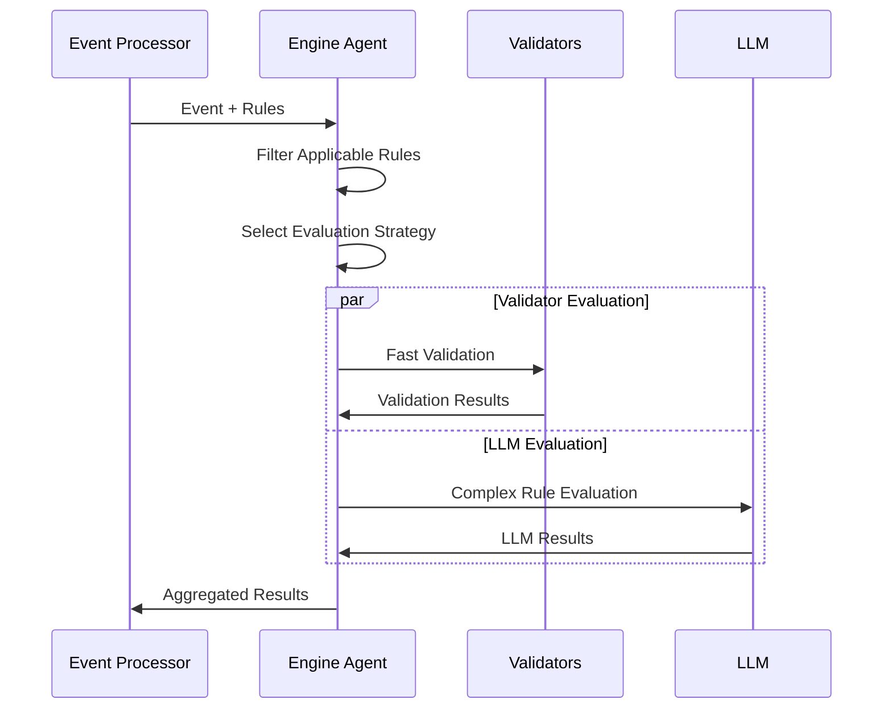

# Watchflow Architecture

This document provides a detailed overview of Watchflow's architecture, design decisions, and technical implementation.

## System Overview

Watchflow is built as a stateless, event-driven system that processes GitHub webhooks and applies intelligent rule evaluation using AI agents. The architecture prioritizes scalability, maintainability, and extensibility.

## Core Architecture

```
┌─────────────────┐    ┌──────────────────┐
│   GitHub App    │── ▶│  Webhook Router  │
│                 │    │                  │
└─────────────────┘    └──────────────────┘
                                │
                                ▼
                       ┌──────────────────┐
                       │  Event Dispatcher│
                       │                  │
                       └──────────────────┘
                                │
                                ▼
                       ┌──────────────────┐
                       │  Event Processors│
                       │                  │
                       └──────────────────┘
                                │
                                ▼
                       ┌──────────────────┐
                       │  AI Agents       │
                       │  (LangGraph)     │
                       └──────────────────┘
                                │
                                ▼
                       ┌──────────────────┐
                       │  GitHub API      │
                       │  (Check Runs)    │
                       └──────────────────┘
```

## Key Components

### 1. Webhook System

The webhook system handles incoming GitHub events with security and reliability:

- **Authentication**: Verifies webhook signatures using HMAC-SHA256
- **Routing**: Routes events to appropriate handlers based on event type
- **Validation**: Validates event payloads and extracts required data
- **Error Handling**: Gracefully handles malformed or unsupported events

### 2. Event Processing Pipeline

Events flow through a structured processing pipeline:

1. **Event Reception**: Webhook receives and validates GitHub events
2. **Context Enrichment**: Enriches event data with repository information
3. **Rule Loading**: Loads applicable rules from repository configuration
4. **Agent Evaluation**: Passes events to AI agents for intelligent evaluation
5. **Result Processing**: Processes evaluation results and takes actions

### 3. AI Agent System

The AI agent system uses LangGraph for orchestrated decision making:

#### Engine Agent
- **Purpose**: Evaluates rules against events using hybrid approach
- **Strategy**: Combines fast validators with LLM reasoning
- **Workflow**: Rule filtering → Validator selection → Parallel evaluation → Result aggregation

#### Feasibility Agent
- **Purpose**: Analyzes natural language rule descriptions
- **Output**: YAML configuration and feasibility assessment
- **Workflow**: Rule analysis → Feasibility check → YAML generation

#### Acknowledgment Agent
- **Purpose**: Evaluates acknowledgment requests from PR comments
- **Context**: Considers rule descriptions, PR data, and acknowledgment reasons
- **Output**: Approval/rejection with detailed reasoning

### 4. Rule System

The rule system provides flexible governance configuration:

#### Rule Definition
```yaml
rules:
  - id: unique-rule-id
    name: Human Readable Name
    description: Natural language description
    enabled: true
    severity: high|medium|low
    event_types: [pull_request, push, deployment]
    parameters:
      # Rule-specific parameters
```

#### Rule Evaluation
- **Event Type Filtering**: Only evaluates rules applicable to event type
- **Parameter Validation**: Validates rule parameters before evaluation
- **Hybrid Evaluation**: Uses validators for common checks, LLM for complex logic
- **Result Aggregation**: Combines results from multiple evaluation methods

### 5. Task Queue System

Asynchronous processing for scalability:

- **Background Processing**: Handles time-consuming operations
- **Retry Logic**: Implements exponential backoff for failed operations
- **Worker Pool**: Configurable number of worker processes
- **Error Handling**: Graceful handling of processing failures

## Data Flow

### 1. Webhook Reception



### 2. Rule Evaluation



## Design Decisions

### 1. Stateless Architecture

**Decision**: Build as stateless service without persistent storage

**Rationale**:
- Enables horizontal scaling
- Simplifies deployment and operations
- Reduces failure points
- Allows for easy restarts and updates

**Trade-offs**:
- No historical data persistence
- Requires external systems for analytics
- Limited to in-memory caching

### 2. Hybrid Rule Evaluation

**Decision**: Combine fast validators with LLM reasoning

**Rationale**:
- 80% speed improvement for common rules
- Maintains flexibility for complex scenarios
- Cost optimization through selective LLM usage
- Better performance for high-frequency events

**Implementation**:
- Fast validators for standard checks (approvals, file size, etc.)
- LLM reasoning for complex business logic
- Intelligent strategy selection based on rule type

### 3. LangGraph for Agent Orchestration

**Decision**: Use LangGraph for AI agent workflows

**Rationale**:
- Structured workflow management
- Built-in state management
- Easy debugging and monitoring
- Integration with LangSmith for observability

**Benefits**:
- Clear workflow visualization
- Step-by-step debugging
- Performance monitoring
- Cost tracking

### 4. Asynchronous Processing

**Decision**: Use async/await throughout the codebase

**Rationale**:
- Better resource utilization
- Improved responsiveness
- Scalability for I/O-bound operations
- Natural fit for webhook processing

**Implementation**:
- FastAPI for async web framework
- Async GitHub API client
- Background task processing
- Concurrent rule evaluation

## Performance Considerations

### 1. Caching Strategy

- **GitHub Tokens**: Cache installation tokens (50-minute TTL)
- **Repository Rules**: Cache rules with repository-based invalidation
- **Agent Results**: No caching to ensure fresh evaluations

### 2. Parallel Processing

- **Rule Evaluation**: Parallel evaluation of independent rules
- **Validator Execution**: Concurrent validator execution
- **API Calls**: Async GitHub API calls with connection pooling

### 3. Resource Management

- **Connection Pooling**: Reuse HTTP connections for GitHub API
- **Memory Management**: Efficient data structures and cleanup
- **CPU Utilization**: Optimized for I/O-bound workloads

## Security Considerations

### 1. Webhook Security

- **Signature Verification**: HMAC-SHA256 signature validation
- **Secret Management**: Secure webhook secret storage
- **Input Validation**: Comprehensive payload validation

### 2. GitHub App Security

- **JWT Authentication**: Secure GitHub App authentication
- **Token Management**: Secure token generation and caching
- **Permission Scoping**: Minimal required permissions

### 3. AI Agent Security

- **Input Sanitization**: Sanitize all inputs to AI agents
- **Output Validation**: Validate AI agent outputs
- **Rate Limiting**: Implement rate limiting for API calls

## Scalability

### 1. Horizontal Scaling

- **Stateless Design**: Enables multiple instances
- **Load Balancing**: Distribute webhook load
- **Worker Processes**: Configurable worker pools

### 2. Performance Monitoring

- **Metrics Collection**: Track response times and throughput
- **Error Monitoring**: Monitor error rates and types
- **Resource Usage**: Monitor CPU, memory, and API usage

### 3. Cost Optimization

- **Selective LLM Usage**: Use validators for common cases
- **Token Optimization**: Optimize prompts for efficiency
- **Caching**: Reduce redundant API calls

## Future Considerations

### 1. Extensibility

- **Plugin System**: Support for custom validators and processors
- **Rule Templates**: Pre-built rule templates for common scenarios
- **Integration APIs**: APIs for external system integration

### 2. Advanced Features

- **Machine Learning**: ML-based rule optimization
- **Predictive Analytics**: Predict potential violations
- **Advanced Acknowledgment**: Multi-step acknowledgment workflows

### 3. Enterprise Features

- **Multi-tenancy**: Support for multiple organizations
- **Audit Logging**: Comprehensive audit trails
- **Compliance Reporting**: Built-in compliance reporting
