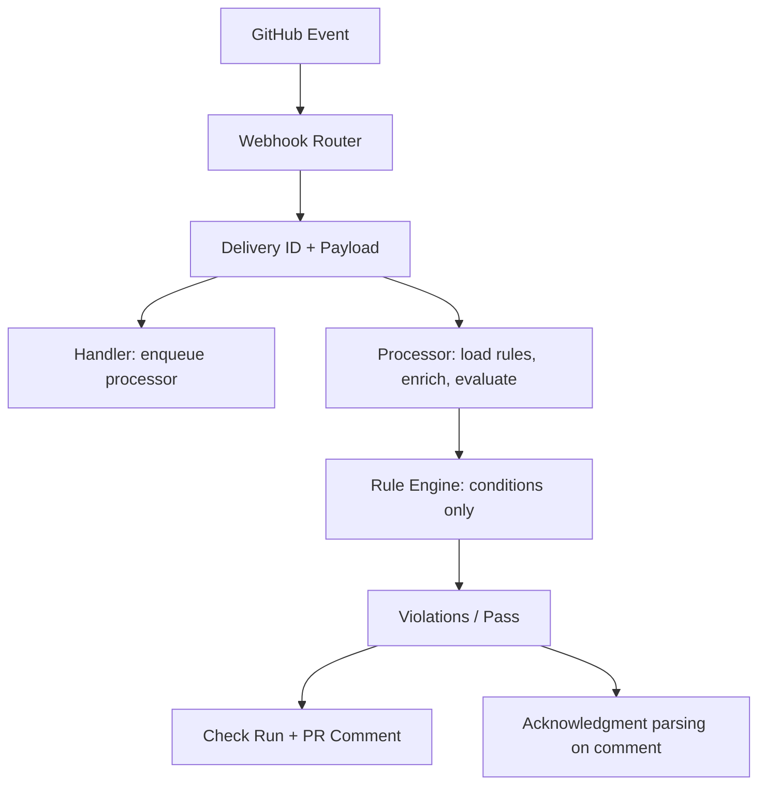

# Architecture Overview

Watchflow is a **rule engine** for GitHub: you define rules in YAML; we evaluate them on PR and push events and surface violations as check runs and PR comments. No custom code in the repo—just conditions and parameters that map to built-in logic. Built for maintainers who want consistent enforcement without another dashboard or “AI-powered” abstraction.

## Design principles

- **Repo-native** — Rules live in `.watchflow/rules.yaml` on the default branch; same mental model as branch protection and CODEOWNERS.
- **Condition-based enforcement** — Rule evaluation is deterministic: parameters map to conditions (e.g. `require_linked_issue`, `max_lines`, `require_code_owner_reviewers`). No LLM in the hot path for “did this PR violate the rule?”
- **Webhook-first** — Each delivery is identified by `X-GitHub-Delivery`; handler and processor get distinct task IDs so both run and comments/check runs stay in sync.
- **Optional intelligence** — Repo analysis and feasibility checks use LLMs to *suggest* rules; enforcement stays rule-driven.

## Flow

1. **Webhook** — GitHub sends `pull_request` or `push`; router reads `X-GitHub-Delivery`, builds `WebhookEvent` with `delivery_id`.
2. **Handler** — Enqueues a processor task with `event_type + delivery_id + func` so dedup doesn’t skip the processor.
3. **Processor** — Loads `.watchflow/rules.yaml` from default branch (via GitHub API). If missing, creates a neutral check run and posts a **welcome comment** with a link to watchflow.dev (`installation_id` + `repo`).
4. **Enrichment** — Fetches PR files, reviews, CODEOWNERS content so conditions can run without a local clone.
5. **Rule engine** — Passes **Rule objects** (with attached condition instances) to the engine. Engine runs each rule’s conditions; no conversion to dicts that would drop conditions.
6. **Output** — Violations → check run + PR comment; developers can reply `@watchflow acknowledge "reason"` where the rule allows it.

## Core components

### Rule loader

- Reads `.watchflow/rules.yaml` from the repo default branch (GitHub App installation token).
- Normalizes parameter aliases (e.g. `max_changed_lines` → `max_lines` for `MaxPrLocCondition`).
- Builds `Rule` objects with condition instances from the **condition registry** (parameter keys map to conditions).

### Condition registry

- Maps parameter names to condition classes (e.g. `require_linked_issue` → `RequireLinkedIssueCondition`, `max_lines` → `MaxPrLocCondition`, `require_code_owner_reviewers` → `RequireCodeOwnerReviewersCondition`).
- Supported conditions: linked issue, title pattern, description length, labels, approvals, PR size (lines), CODEOWNERS (path has owner, require owners as reviewers), protected branches, no force push, file size, file pattern, time/deploy rules. See [Configuration](../getting-started/configuration.md).

### PR enricher

- Adds to event data: PR files, reviews, **CODEOWNERS file content** (from `.github/CODEOWNERS`, `CODEOWNERS`, or `docs/CODEOWNERS`) so CODEOWNERS-based conditions don’t need a local clone.

### Task queue

- Task ID = `hash(event_type + delivery_id + func_qualname)` when `delivery_id` is present so handler and processor both run per delivery.

## Where AI is used (and where it isn’t)

- **Rule evaluation** — No. Violations are determined by conditions only.
- **Acknowledgment parsing** — Optional LLM to interpret reason; can be extended.
- **Repo analysis** — Yes. `POST /api/v1/rules/recommend` uses an agent to suggest rules from repo structure and PR history; you copy/paste or create a PR.
- **Feasibility** — Yes. “Can I enforce this rule?” uses an agent to map natural language to supported conditions and suggest YAML.

So: **enforcement is deterministic and condition-based**; **suggestions and feasibility are agent-assisted**. That keeps the hot path simple and auditable.

## Use cases

- **CODEOWNERS enforcement** — Require that owners for modified paths are requested as reviewers; or require every changed path to have an owner.
- **Traceability** — Require linked issue, title pattern, minimum description length.
- **Review quality** — Max PR size (lines), min approvals, required labels.
- **Branch safety** — No force push, protected branch targets.
- **Deploy safety** — Time windows, environment approvals (deployment events).

## Docs

- [Quick Start](../getting-started/quick-start.md)
- [Configuration](../getting-started/configuration.md)
- [Features](../features.md)
