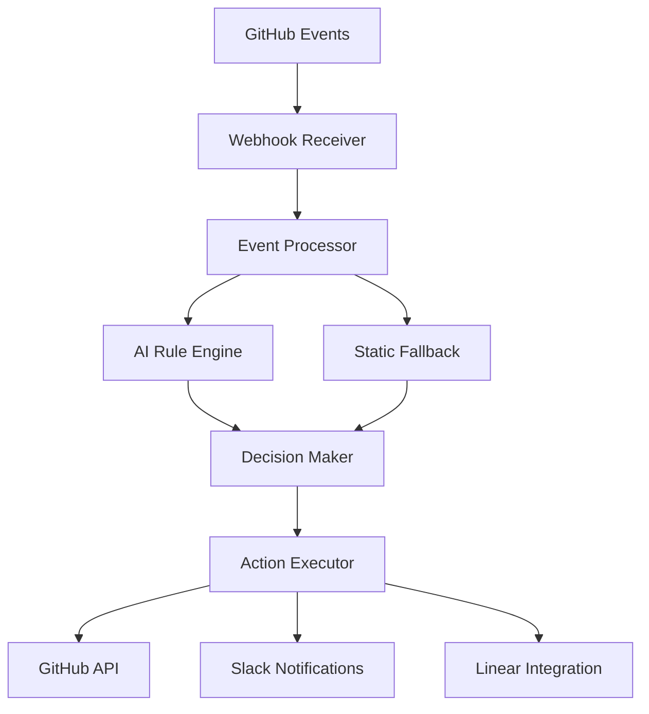

# Architecture Overview

Watchflow replaces static protection rules with context-aware monitoring. Our hybrid architecture combines rule-based
logic with AI intelligence to ensure consistent quality standards so teams can focus on building, increase trust, and
move fast.

> **Experience the power of agentic governance** - then scale to enterprise with [Warestack](https://www.warestack.com/)

## Hybrid Architecture

Watchflow uses a unique hybrid architecture that combines rule-based logic with AI-powered intelligence:

## Core Components

### Rule Engine
- **Static Rule Processing**: Fast, deterministic rule evaluation
- **Condition Matching**: Pattern-based condition checking
- **Action Execution**: Immediate enforcement actions
- **Validation**: Rule syntax and logic validation

### AI Agents
- **Feasibility Agent**: Determines if rules can be enforced
- **Engine Agent**: Evaluates complex scenarios and context
- **Acknowledgment Agent**: Processes violation acknowledgments
- **Context Awareness**: Understands repository and team dynamics

### Decision Orchestrator
- **Hybrid Logic**: Combines rule and AI outputs intelligently
- **Conflict Resolution**: Handles conflicting recommendations
- **Business Logic**: Applies organizational policies
- **Audit Trail**: Maintains decision history and reasoning

## Key Benefits

### Context-Aware Guardrails
- **Intelligent Decisions**: Considers repository structure, team roles, and historical patterns
- **Adaptive Enforcement**: Adjusts behavior based on team feedback and patterns
- **Learning Capability**: Improves accuracy over time through feedback loops
- **Nuanced Understanding**: Distinguishes between legitimate exceptions and actual violations

### Developer Experience
- **Plug n Play Integration**: Works within GitHub interface
- **Clear Communication**: Provides detailed explanations for decisions
- **Acknowledgment Workflow**: Allows legitimate exceptions with proper documentation
- **Real-time Feedback**: Immediate responses to events and actions

### Operational Efficiency
- **Reduced False Positives**: AI-powered context analysis minimizes unnecessary blocks
- **Automated Enforcement**: Handles routine governance tasks automatically
- **Scalable Architecture**: Grows with your organization and repository complexity
- **Audit Compliance**: Maintains complete audit trails for compliance requirements

## How It Works

### 1. Event Processing
When a GitHub event occurs (PR creation, deployment, etc.), Watchflow:
- Receives the webhook event
- Analyzes the context and repository state
- Identifies applicable rules based on event type and content

### 2. Hybrid Evaluation
For each applicable rule, Watchflow:
- **Rule Engine**: Evaluates static conditions and patterns
- **AI Agents**: Analyze context, team dynamics, and historical patterns
- **Decision Orchestrator**: Combines both outputs to make final decision

### 3. Action Execution
Based on the evaluation, Watchflow:
- Executes appropriate actions (block, comment, approve)
- Provides clear explanations for decisions
- Maintains audit trail for compliance

### 4. Feedback Loop
Developers can:
- Acknowledge violations with reasoning
- Request escalations for urgent cases
- Provide feedback to improve AI accuracy

## Use Cases

### Security Governance
- **Code Security**: Detect security-sensitive changes and require review
- **Access Control**: Enforce team-based approval requirements
- **Compliance**: Ensure security policies are followed
- **Audit Trail**: Maintain complete security decision history

### Quality Assurance
- **Code Review**: Ensure proper review coverage and quality
- **Testing Requirements**: Enforce testing standards and coverage
- **Documentation**: Require documentation for complex changes
- **Standards Compliance**: Enforce coding standards and practices

### Deployment Safety
- **Environment Protection**: Prevent unauthorized production deployments
- **Approval Workflows**: Require explicit approval for critical deployments
- **Rollback Protection**: Ensure safe deployment practices
- **Change Management**: Track and control deployment changes

### Team Collaboration
- **Review Distribution**: Ensure balanced review workload
- **Knowledge Sharing**: Require cross-team reviews for critical changes
- **Mentorship**: Encourage senior developer involvement
- **Onboarding**: Guide new team members through proper processes

## Evaluation Benchmarks

### Performance Metrics
- **Response Time**: < 2 seconds for rule evaluation
- **Accuracy**: > 95% correct rule enforcement
- **False Positive Rate**: < 5% of total evaluations
- **Scalability**: Handles 1000+ repositories simultaneously

### Impact Metrics
- **Security Incidents**: 80% reduction in security-related incidents
- **Review Time**: 60% faster review cycles through intelligent routing
- **Compliance**: 100% audit trail coverage for governance decisions
- **Developer Satisfaction**: 90% positive feedback on governance experience

### Adoption Metrics
- **Time to Value**: Teams see benefits within first week
- **Rule Effectiveness**: 85% of rules work correctly out of the box
- **Acknowledgment Rate**: 70% of violations properly acknowledged
- **Escalation Rate**: < 10% of decisions require human escalation
